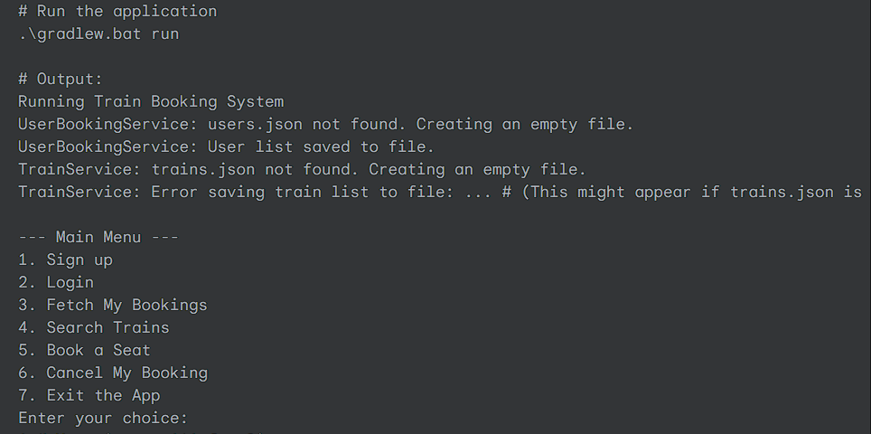

# Train-Ticket-Booking-System

## 🚂 Java Console-Based Train Ticket Booking System

A console-based application built with Java and Gradle for managing train bookings, user accounts, and train seat availability, with data persistence handled via JSON files.

✨ Features
User Management: Sign up new users, log in existing users, and secure user accounts with hashed passwords.

Train Search: Find available trains between specified source and destination stations.

Seat Booking: Book seats on available trains, with real-time updates to seat availability.

Booking Management: Fetch and view personal booking history, and cancel existing bookings.

Data Persistence: All user and train data is stored and loaded from local JSON files, ensuring data is saved across application runs.

🚀 Technologies Used
Java: The core programming language for the application logic.

Gradle: Build automation tool for managing dependencies and project compilation.

Jackson: A high-performance JSON processor for serializing Java objects to JSON and deserializing JSON to Java objects.

jBCrypt: A library for secure password hashing and verification.

🛠️ Getting Started
Prerequisites
Java Development Kit (JDK) 21 or later. You can download it from Oracle JDK or OpenJDK.

Git (optional, for cloning the repository).

Cloning the Repository (if applicable)
git clone https://github.com/your-username/your-repository-name.git
cd your-repository-name/app # Navigate into the 'app' module

Project Structure
The core application logic resides in the app module.

app/src/main/java/org/example/: Contains the main App class and utility/service classes.

app/src/main/java/org/example/entities/: Contains the Java POJOs (Plain Old Java Objects) for User, Train, and Ticket.

app/src/main/java/org/example/service/: Contains the business logic for user management (UserBookingService) and train management (TrainService).

app/src/main/java/org/example/util/: Contains utility classes like UserServiceUtil for password hashing.

app/src/main/resources/localDB/: This directory will store your users.json and trains.json files for data persistence. These files will be created automatically if they don't exist when the application runs for the first time.

Setup and Running the Application
Navigate to the project's root directory in your terminal. This is the directory containing gradlew.bat (or gradlew on Linux/macOS) and the app folder.

cd C:\Users\ARKADIP GHOSH\Desktop\GOAL\Projects\IRCTC # Example path

Build the project. This compiles all Java files and resolves dependencies.

.\gradlew.bat clean build --no-build-cache # For Windows
# Or for Linux/macOS:
# ./gradlew clean build --no-build-cache

Wait for BUILD SUCCESSFUL message.

Run the application.

.\gradlew.bat run # For Windows
# Or for Linux/macOS:
# ./gradlew run

Interact with the application.
The application will print a menu to the console, and you can type your choices (numbers 1-7) and press Enter to interact.

💾 Data Files (.json)
The application uses users.json and trains.json for data persistence.

users.json: Stores user details, including hashed passwords and their booked tickets.

trains.json: Stores train details, including available seats and station schedules.

These files are located in app/src/main/resources/localDB/. If these files do not exist when the application runs, they will be created automatically with empty data structures.

Sample trains.json Content (Initial)
[
    {
        "train_id": "bacs",
        "train_no": "12345",
        "seats": [
            [0,0,0,0,0,0],
            [0,0,0,0,0,0],
            [0,0,0,0,0,0],
            [0,0,0,0,0,0]
        ],
        "station_times": {
            "bangalore": "13:50:00",
            "jaipur": "13:50:00",
            "delhi": "13:50:00"
        },
        "stations": [
            "bangalore",
            "jaipur",
            "delhi"
        ]
    },
    {
        "train_id": "train_xyz",
        "train_no": "67890",
        "seats": [
            [0,0,0,0,0,0],
            [0,0,0,0,0,0],
            [0,0,0,0,0,0],
            [0,0,0,0,0,0]
        ],
        "station_times": {
            "mumbai": "10:00:00",
            "pune": "12:00:00",
            "chennai": "18:00:00"
        },
        "stations": [
            "mumbai",
            "pune",
            "chennai"
        ]
    }
]

🖥️ Sample Interaction / Output
Here's a simulated terminal session demonstrating a user signing up, logging in, searching for a train, booking a seat, and viewing their bookings.

# Run the application .\gradlew.bat run # Output: Running Train Booking System UserBookingService: users.json not found. Creating an empty file. UserBookingService: User list saved to file. TrainService: trains.json not found. Creating an empty file. TrainService: Error saving train list to file: ... # (This might appear if trains.json is initially empty) --- Main Menu --- 1. Sign up 2. Login 3. Fetch My Bookings 4. Search Trains 5. Book a Seat 6. Cancel My Booking 7. Exit the App Enter your choice: 1 # User inputs '1' for Sign up Enter a username to sign up: john.doe # User inputs username Enter a password to sign up: mysecret123 # User inputs password UserBookingService: User list saved to file. Signup successful! Welcome, john.doe. --- Main Menu --- 1. Sign up 2. Login 3. Fetch My Bookings 4. Search Trains 5. Book a Seat 6. Cancel My Booking 7. Exit the App Enter your choice: 2 # User inputs '2' for Login Enter your username: john.doe # User inputs username Enter your password: mysecret123 # User inputs password Login successful! Welcome back, john.doe. --- Main Menu --- 1. Sign up 2. Login 3. Fetch My Bookings 4. Search Trains 5. Book a Seat 6. Cancel My Booking 7. Exit the App Enter your choice: 4 # User inputs '4' for Search Trains Type your source station: bangalore # User inputs source Type your destination station: delhi # User inputs destination Available Trains: 1. Train ID: bacs (No: 12345) Stations: [bangalore, jaipur, delhi] Available Seats: 24 --- Main Menu --- 1. Sign up 2. Login 3. Fetch My Bookings 4. Search Trains 5. Book a Seat 6. Cancel My Booking 7. Exit the App Enter your choice: 5 # User inputs '5' for Book a Seat Type your source station for booking: bangalore # User inputs source again Type your destination station for booking: delhi # User inputs destination again Available Trains for Booking: 1. Train ID: bacs (No: 12345) Available Seats: 24 Select a train by typing its number (1, 2, 3...): 1 # User selects train 1 Current seat layout (0=available, 1=booked): 0 0 0 0 0 0 0 0 0 0 0 0 0 0 0 0 0 0 0 0 0 0 0 0 Select the seat by typing the row and column (0-indexed) Enter the row: 0 # User enters row 0 Enter the column: 0 # User enters column 0 Attempting to book your seat.... TrainService: Seats updated for train: bacs UserBookingService: User list saved to file. Booked! Enjoy your journey! --- Main Menu --- 1. Sign up 2. Login 3. Fetch My Bookings 4. Search Trains 5. Book a Seat 6. Cancel My Booking 7. Exit the App Enter your choice: 3 # User inputs '3' for Fetch My Bookings Your Bookings: --- Tickets for john.doe --- Ticket ID: [UUID] | User: [UUID] | From: bangalore | To: delhi | On: [Date Time String] | Train: bacs ------------------------- --- Main Menu --- 1. Sign up 2. Login 3. Fetch My Bookings 4. Search Trains 5. Book a Seat 6. Cancel My Booking 7. Exit the App Enter your choice: 7 # User inputs '7' for Exit Exiting application. Goodbye! # Application terminates
📝 Future Enhancements
Graphical User Interface (GUI): Implement a user-friendly GUI using technologies like JavaFX or Swing.

Database Integration: Replace JSON file persistence with a robust database (e.g., H2, MySQL, PostgreSQL) for better data management and scalability.

Advanced Booking Features: Implement seat selection logic (e.g., specific seat numbers, class types), multiple passenger bookings.

Train Schedule Management: Add an admin interface for managing train schedules, adding/removing trains, and updating routes.

Payment Gateway Integration: Simulate or integrate with a payment system for ticket purchases.

JUnit Testing: Expand unit and integration tests for more comprehensive code coverage.

Date/Time Handling: Use java.time.LocalDate or LocalDateTime more extensively and consistently for dateOfTravel in Ticket and Train entities, potentially with custom Jackson serializers/deserializers for specific formats.

🤝 Contributing
Contributions are welcome! If you have suggestions or find issues, please open an issue or submit a pull request.

📄 License
This project is licensed under the MIT License - see the LICENSE file (if you have one) for details.
